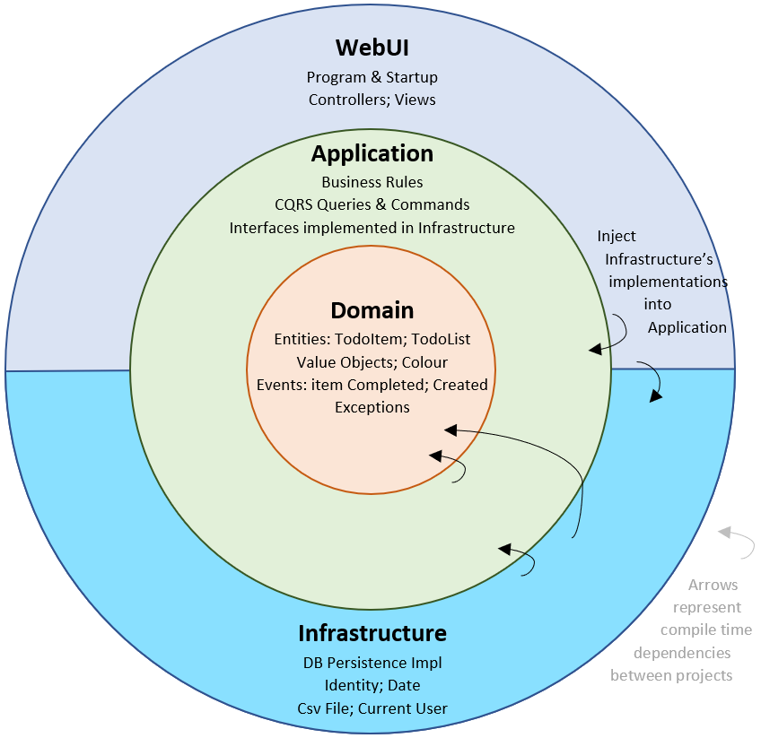

# Informe de Arquitectura de Software

## Sistema de Gestión de Bajas Técnicas

---

**Proyecto:** Sistema de Gestión de Bajas Técnicas para Empresa de Infocomunicaciones  
**Fecha:** 15 de Octubre de 2025  
**Equipo:** Equipo 5
- Jocdan L. López Mantecón
- Kevin A. Torres Perera
- Lianny Revée Valdivieso
- Cristhian Delgado García

**Curso:** Ingeniería de Software - 3er Año  

---

## Tabla de Contenidos

- [Informe de Arquitectura de Software](#informe-de-arquitectura-de-software)
  - [Sistema de Gestión de Bajas Técnicas](#sistema-de-gestión-de-bajas-técnicas)
  - [Tabla de Contenidos](#tabla-de-contenidos)
  - [Resumen](#resumen)
  - [1. Decsripcion del Negocio](#1-decsripcion-del-negocio)
  - [2. Arquitectura Propuesta](#2-arquitectura-propuesta)
    - [2.1 Nombre y Descripción](#21-nombre-y-descripción)
      - [Clean Architecture](#clean-architecture)
  - [3. Justificación y Fundamentación](#3-justificación-y-fundamentación)
    - [3.1 Análisis del Contexto del Proyecto](#31-análisis-del-contexto-del-proyecto)
      - [Complejidad del Dominio](#complejidad-del-dominio)
      - [Múltiples Roles de Usuario](#múltiples-roles-de-usuario)
      - [Reglas de Negocio](#reglas-de-negocio)
      - [Requisitos de Calidad](#requisitos-de-calidad)
    - [3.2 Diagrama de Arquitectura](#32-diagrama-de-arquitectura)
  - [4. Estructura de Capas](#4-estructura-de-capas)
    - [4.1 Capa de Presentación (React)](#41-capa-de-presentación-react)
    - [4.2 Capa de API (.NET Web API)](#42-capa-de-api-net-web-api)
    - [4.3 Capa de Aplicación](#43-capa-de-aplicación)
    - [4.4 Capa de Dominio](#44-capa-de-dominio)
    - [4.5 Capa de Infraestructura](#45-capa-de-infraestructura)
  - [5. Patrones de Diseño](#5-patrones-de-diseño)
    - [5.1 Repository Pattern](#51-repository-pattern)
    - [5.2 CQRS (Command Query Responsibility Segregation)](#52-cqrs-command-query-responsibility-segregation)
    - [5.3 Unit of Work](#53-unit-of-work)
  - [6. Stack Tecnológico](#6-stack-tecnológico)
  - [7. Ventajas de la Arquitectura](#7-ventajas-de-la-arquitectura)
    - [7.1 Ventajas Técnicas](#71-ventajas-técnicas)
      - [1. Desacoplamiento Total](#1-desacoplamiento-total)
      - [2. Testabilidad Excepcional](#2-testabilidad-excepcional)
      - [3. Mantenibilidad Alta](#3-mantenibilidad-alta)
      - [4. Extensibilidad](#4-extensibilidad)
      - [5. Independencia del Framework](#5-independencia-del-framework)
      - [6. Escalabilidad](#6-escalabilidad)
    - [7.2 Ventajas para el Negocio](#72-ventajas-para-el-negocio)
      - [1. Expresividad del Dominio](#1-expresividad-del-dominio)
      - [2. Reducción de Acoplamiento Accidental](#2-reducción-de-acoplamiento-accidental)
      - [3. Preparada para Cambios](#3-preparada-para-cambios)
      - [4. Reducción de Costos a Largo Plazo](#4-reducción-de-costos-a-largo-plazo)
  - [8. Desventajas](#8-desventajas)
    - [8.1 Desventajas Identificadas](#81-desventajas-identificadas)
      - [1. Complejidad Inicial Alta](#1-complejidad-inicial-alta)
      - [2. Overhead en Proyectos Simples](#2-overhead-en-proyectos-simples)
      - [3. Tiempo de Desarrollo Inicial Mayor](#3-tiempo-de-desarrollo-inicial-mayor)
      - [4. Requiere Disciplina del Equipo](#4-requiere-disciplina-del-equipo)
      - [5. Duplicación Aparente](#5-duplicación-aparente)
      - [6. Dificultad para Desarrolladores Junior](#6-dificultad-para-desarrolladores-junior)
  - [9. Conclusiones](#9-conclusiones)
    - [9.1 Resumen de la Decisión Arquitectónica](#91-resumen-de-la-decisión-arquitectónica)
    - [9.2 Justificación Final](#92-justificación-final)
    - [9.3 Beneficios Clave](#93-beneficios-clave)
    - [9.4 Consideraciones Finales](#94-consideraciones-finales)
  - [Referencias](#referencias)

---

##  Resumen

Este documento presenta la arquitectura de software propuesta para el **Sistema de Gestión de Bajas Técnicas**, una aplicación web diseñada para automatizar y optimizar la gestión del inventario de equipos, procesos de baja, traslados y mantenimientos en una empresa de infocomunicaciones.

---
## 1. Decsripcion del Negocio

  Se desea confeccionar una aplicación web que de como solución un sistema de la gestión de las bajas técnicas para una empresa de infocomunicaciones. Este sistema debe manejar el inventario de equipos, los procesos de baja y traslado de equipos, los mantenimientos, el personal técnico involucrado y las personas responsables de recibir los equipos tras su baja o traslado. El objetivo es automatizar y optimizar la gestión de las bajas técnicas, lo cual actualmente se realiza de manera manual así como el riesgo de pérdida de información debido al gran volumen de datos.

El sistema debe de permitir la existencia de usuario capaz de tener acceso a la gestión completa del inventario de los equipos, las bajas y los mantenimientos realizados, cuyo acceso le posibilitará la modificación de los datos existentes o añadir nueva información.

Cada sección tiene asignado un responsable, el cual puede solicitar el traslado de los equipos y revisar los inventarios de su área. Los técnicos, usuarios que trabajarán con el sistema diariamente, podrán registrar las intervenciones de sus mantenimientos realizados y definir las bajas de los equipos atendidos por ellos.

El personal encargado de recibir los equipos ser revisados y/o reparados es responsable de registrar en el sistema el recibimiento de los equipos, así como los traslados y las bajas propuestas por los técnicos; durante el proceso de la recepción se define el departamento responsable a trabajar con el dispositivo. También, el director del centro tiene control total sobre la información manejada sobre el sistema y puede generar los reportes asociados el estado del inventario, las bajas técnicas y la efectividad del personal.

Sobre la información, cada equipo tendrá un identificador único, el nombre del equipo, su tipo (informático, de comunicaciones, eléctrico, etc.), su estado (operativo, en mantenimiento, dado de baja), su ubicación actual y la fecha de adquisición. Además, se debe almacenar el historial de los mantenimientos realizados, con detalles como la fecha del mantenimiento, el tipo de mantenimiento, el costo asociado y el técnico responsable.

Cuando un equipo es dado de baja, se registra la causa de la baja (fallo técnico irreparable, obsolescencia, entre otras), la fecha de la baja, el destino final del equipo (almacén, desecho, traslado a otra unidad), así como la persona que recibe el equipo en su destino. De este tipo de persona, conocida como "receptor del equipo", se registrarán su identificador, el nombre, el departamento al que pertenece, el departamento al que enviará el equipo y el nombre de la persona que envía el equipo.

El sistema también gestionará los traslados de equipos entre diferentes secciones o unidades, registrando la fecha del traslado, el origen, el destino, el personal responsable del envío y el receptor del equipo.

Se deberá llevar un registro detallado de los técnicos encargados del mantenimiento y baja de los equipos. De cada técnico se almacenará su nombre, número de identificación, años de experiencia, especialidad y el historial de intervenciones que ha realizado (mantenimientos o bajas). Además, se llevará un registro del rendimiento de los técnicos, basado en las valoraciones de sus superiores, que pueden afectar su salario con bonificaciones o penalizaciones.

---
## 2. Arquitectura Propuesta

### 2.1 Nombre y Descripción

#### Clean Architecture

La Clean Architecture es un patrón arquitectónico que organiza el código en capas concéntricas, donde las dependencias apuntan siempre hacia el centro (el dominio). Esta arquitectura prioriza la independencia de frameworks, UI, bases de datos y cualquier agente externo, colocando la lógica de negocio en el núcleo del sistema.

Esta arquitectura ha sido seleccionada por su capacidad de:
    - Proporcionar **desacoplamiento total** entre capas
    - Garantizar **alta testabilidad** en todos los niveles
    - Facilitar **extensibilidad** y **mantenibilidad** a largo plazo
    - Cumplir con todos los requisitos técnicos del proyecto

---

## 3. Justificación y Fundamentación

### 3.1 Análisis del Contexto del Proyecto

El proyecto presenta las siguientes características que determinan la elección arquitectónica:

#### Complejidad del Dominio

- Múltiples entidades interrelacionadas: Equipos, Técnicos, Bajas, Mantenimientos, Traslados, Receptores
- Flujos de trabajo complejos con múltiples estados
- Reglas de negocio específicas del dominio

#### Múltiples Roles de Usuario

- **Administrador:** Gestión completa del sistema
- **Director:** Control total y generación de reportes
- **Responsable de Sección:** Solicitud de traslados y revisión de inventarios
- **Técnicos:** Registro de mantenimientos y definición de bajas
- **Personal de Recepción:** Registro de recepción de equipos

#### Reglas de Negocio

- Gestión de inventario con historial completo
- Flujos de aprobación para bajas y traslados
- Cálculo de rendimiento de técnicos con bonificaciones/penalizaciones
- Validaciones específicas para cada operación

#### Requisitos de Calidad

- **Mantenibilidad:** El sistema debe crecer en funcionalidades
- **Extensibilidad:** Nuevas características sin modificar código existente
- **Desacoplamiento:** Separación clara entre capas
- **Testabilidad:** Pruebas unitarias exhaustivas en frontend y backend

### 3.2 Diagrama de Arquitectura

---

## 4. Estructura de Capas

### 4.1 Capa de Presentación (React)

**Responsabilidad:** Interfaz de usuario y experiencia del usuario

**Componentes:**

- **Components:** Componentes React reutilizables
- **Pages:** Vistas principales de la aplicación
- **State Management:** Redux Toolkit o Zustand para manejo de estado global
- **API Services:** Clientes HTTP para comunicación con el backend
- **Hooks Personalizados:** Lógica reutilizable de la UI
- **Utils:** Funciones auxiliares y helpers

### 4.2 Capa de API (.NET Web API)

**Responsabilidad:** Punto de entrada HTTP, serialización/deserialización, autenticación

**Componentes:**

- **Controllers:** Endpoints REST que exponen la funcionalidad
- **DTOs:** Data Transfer Objects para comunicación cliente-servidor
- **Middleware:** Autenticación, logging, manejo de errores global
- **Filters:** Validación de requests, autorización
- **Configuration:** Inyección de dependencias, configuración de servicios

### 4.3 Capa de Aplicación

**Responsabilidad:** Orquestación de casos de uso, lógica de aplicación

**Componentes:**

- **Commands:** Operaciones que modifican el estado (CreateEquipo, UpdateBaja)
- **Queries:** Operaciones de consulta (GetEquipoById, ListTecnicos)
- **Handlers:** Implementación de la lógica de cada comando/query
- **Validators:** Validación de reglas de aplicación con FluentValidation
- **DTOs:** Objetos de transferencia específicos de la aplicación
- **Interfaces:** Contratos para servicios externos (IEmailService, IFileStorage)

### 4.4 Capa de Dominio

**Responsabilidad:** Lógica de negocio pura, reglas del dominio

**Componentes:**

- **Entities:** Objetos con identidad (Equipo, Tecnico, Baja, Mantenimiento, Traslado)
- **Value Objects:** Objetos sin identidad (EstadoEquipo, TipoEquipo, Direccion)
- **Aggregates:** Conjuntos de entidades tratadas como unidad
- **Domain Services:** Lógica que no pertenece a una entidad específica
- **Domain Events:** Eventos del dominio (EquipoDadoDeBaja, MantenimientoCompletado)
- **Repository Interfaces:** Contratos para persistencia
- **Specifications:** Criterios de consulta reutilizables

### 4.5 Capa de Infraestructura

**Responsabilidad:** Implementación de acceso a datos y servicios externos

**Componentes:**

- **DbContext:** Contexto de Entity Framework Core
- **Entity Configurations:** Configuración de mapeo ORM
- **Repositories:** Implementación de los repositorios
- **Migrations:** Migraciones de base de datos
- **External Services:** Implementación de servicios externos (Email, SMS, etc.)

---

## 5. Patrones de Diseño

La arquitectura propuesta implementa varios patrones de diseño reconocidos que mejoran la calidad del código y cumplen con los requisitos del proyecto.

### 5.1 Repository Pattern

**Propósito:** Abstrae el acceso a datos y proporciona una interfaz uniforme para operaciones CRUD.

**Implementación:**

- Las **interfaces** se definen en la capa de **Domain**
- Las **implementaciones** se encuentran en la capa de **Infrastructure**
- Permite cambiar la tecnología de persistencia sin afectar la lógica de negocio

### 5.2 CQRS (Command Query Responsibility Segregation)

**Propósito:** Separa las operaciones de lectura (Queries) de las operaciones de escritura (Commands).

**Implementación:**

- **Commands:** Modifican el estado del sistema (Create, Update, Delete)
- **Queries:** Consultan información sin modificar el estado
- Utiliza **MediatR** para el patrón Mediator

### 5.3 Unit of Work

**Propósito:** Mantiene la consistencia transaccional coordinando múltiples repositorios.

**Implementación:**

- Agrupa operaciones en una única transacción
- Garantiza atomicidad en operaciones complejas
- Se implementa sobre el `DbContext` de Entity Framework Core

---

## 6. Stack Tecnológico

| Componente | Tecnología | Versión | Propósito |
|------------|-----------|---------|-----------|
| **Framework** | React  | 18+ | Construcción de UI |
| **Framework** | .NET | 8 (LTS) | Framework principal del backend |
| **ORM** | Entity Framework Core | 8 | Mapeo objeto-relacional |
| **API** | ASP.NET Core Web API | 8 | Construcción de API RESTful |
| **Mediator** | MediatR | 9+ | Implementación de CQRS |
| **Lenguaje** | TypeScript | 4.x | Tipado estático |
| **Lenguaje** | C# | 11 | Lenguaje principal del backend |
| **Control de Versiones** | Git + GitHub | N/A | Gestión de código fuente |
| **Base de Datos** | PostgreSQL | 15+ | Almacenamiento de datos |

---

## 7. Ventajas de la Arquitectura

### 7.1 Ventajas Técnicas

#### 1. Desacoplamiento Total

- Cada capa puede evolucionar independientemente
- Fácil reemplazo de tecnologías (ejemplo: cambiar EF Core por Dapper)
- Las dependencias apuntan siempre hacia el dominio (Dependency Inversion)

#### 2. Testabilidad Excepcional

- La capa de dominio es 100% testeable sin dependencias externas
- Mocking sencillo gracias a las interfaces

#### 3. Mantenibilidad Alta

- Código organizado por responsabilidades claras (Single Responsibility)
- Reglas de negocio centralizadas en el dominio
- Fácil localización y corrección de bugs
- Estructura predecible y consistente

#### 4. Extensibilidad

- Agregar nuevas funcionalidades sin modificar código existente (Open/Closed Principle)
- Nuevos casos de uso son solo nuevos handlers
- Facilita el crecimiento incremental del sistema

#### 5. Independencia del Framework

- El dominio no conoce Entity Framework ni ASP.NET
- Migraciones tecnológicas menos dolorosas
- Reduce el acoplamiento a vendors específicos

#### 6. Escalabilidad

- CQRS permite escalar lecturas y escrituras independientemente
- Preparada para evolucionar a microservicios en el futuro
- Optimización de consultas sin afectar comandos

### 7.2 Ventajas para el Negocio

#### 1. Expresividad del Dominio

- El código refleja el lenguaje del negocio (Ubiquitous Language de DDD)
- Términos como `Equipo`, `Baja`, `Mantenimiento` son parte del código
- Fácil comunicación con stakeholders no técnicos

#### 2. Reducción de Acoplamiento Accidental

- Las reglas de negocio no se mezclan con infraestructura
- Menos bugs por efectos colaterales
- Mayor claridad en la lógica empresarial

#### 3. Preparada para Cambios

- El negocio puede evolucionar sin reescrituras mayores
- Cambios en UI no afectan la lógica de negocio
- Nuevas funcionalidades se agregan con impacto mínimo

#### 4. Reducción de Costos a Largo Plazo

- Menor tiempo de mantenimiento
- Menos deuda técnica
- Facilita la incorporación de nuevos desarrolladores

---

## 8. Desventajas

### 8.1 Desventajas Identificadas

#### 1. Complejidad Inicial Alta

- Requiere experiencia en arquitectura de software
- Curva de aprendizaje pronunciada para el equipo
- Más archivos y carpetas que gestionar

#### 2. Overhead en Proyectos Simples

- Para un CRUD básico puede ser "over-engineering"
- Mayor cantidad de código boilerplate (código repetitivo que se usa como plantilla básica en programación para ahorrar tiempo)

#### 3. Tiempo de Desarrollo Inicial Mayor

- Setup inicial más largo (estructura de proyectos, configuración)
- Primera funcionalidad tarda más en implementarse

#### 4. Requiere Disciplina del Equipo

- Fácil romper las capas si no hay revisión de código
- Necesita documentación clara de las reglas arquitectónicas
- Puede haber debate sobre dónde va cada cosa

#### 5. Duplicación Aparente

**Desventaja:**

- DTOs en múltiples capas puede parecer redundante
- Mapeos entre objetos añaden verbosidad

#### 6. Dificultad para Desarrolladores Junior

**Desventaja:**

- Conceptos avanzados (DDD, CQRS, IoC, Dependency Injection)
- Requiere mentoría y documentación exhaustiva

## 9. Conclusiones

### 9.1 Resumen de la Decisión Arquitectónica

Después de un análisis exhaustivo del proyecto **Sistema de Gestión de Bajas Técnicas**, se ha seleccionado **Clean Architecture con Domain-Driven Design (DDD)** como la arquitectura óptima para su desarrollo.

### 9.2 Justificación Final

Esta decisión se fundamenta en:

1. **Complejidad del Dominio:** El sistema maneja múltiples entidades interrelacionadas, roles de usuario complejos y reglas de negocio específicas que requieren una arquitectura robusta.

2. **Cumplimiento Total de Requisitos:** La arquitectura propuesta cumple con todos los requisitos técnicos del proyecto:
   - Control de versiones (GitHub)
   - Uso de .NET 8 y Entity Framework Core
   - Implementación de múltiples patrones de diseño
   - Arquitectura desacoplada, extensible y mantenible
   - Soporte completo para pruebas unitarias

3. **Preparación para el Futuro:** El sistema está diseñado para crecer y evolucionar sin necesidad de reescrituras mayores, facilitando la incorporación de nuevas funcionalidades.

4. **Valor Educativo:** Como proyecto académico, proporciona experiencia valiosa en arquitecturas modernas de software, patrones de diseño y mejores prácticas de la industria.

### 9.3 Beneficios Clave

- **Mantenibilidad:** Código organizado y fácil de mantener
- **Testabilidad:** Cobertura de pruebas exhaustiva en todas las capas
- **Escalabilidad:** Preparada para crecimiento futuro
- **Desacoplamiento:** Independencia entre capas y tecnologías
- **Expresividad:** El código refleja el lenguaje del negocio

### 9.4 Consideraciones Finales

Si bien la arquitectura presenta una mayor complejidad inicial y requiere disciplina del equipo, estos costos son ampliamente compensados por:

- Reducción dramática del tiempo de mantenimiento
- Facilidad para agregar nuevas funcionalidades
- Mayor calidad y confiabilidad del código
- Experiencia técnica valiosa para el equipo de desarrollo

---

## Referencias

1. **Clean Architecture** - Robert C. Martin (Uncle Bob)
2. **Microsoft .NET Architecture Guides** - Microsoft Docs
3. **CQRS Pattern** - Martin Fowler
4. **Repository Pattern** - Edward Hieatt and Rob Mee

---

**Documento preparado por:** Equipo 5  
**Fecha de elaboración:** 15 de Octubre de 2025  
